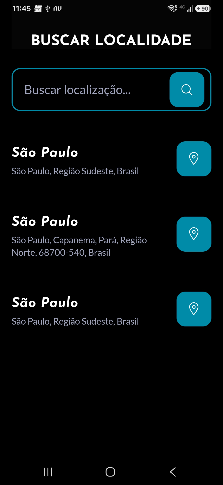
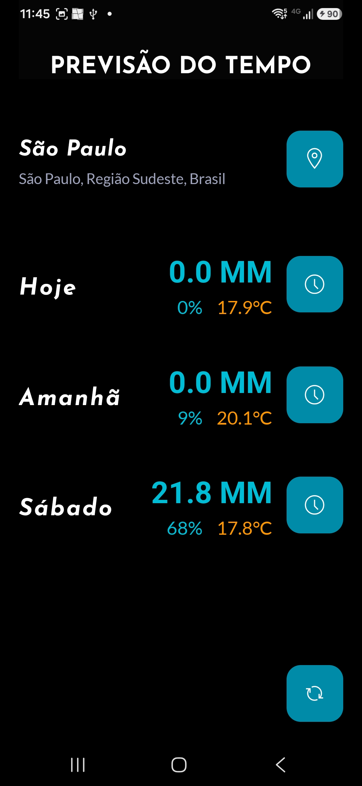
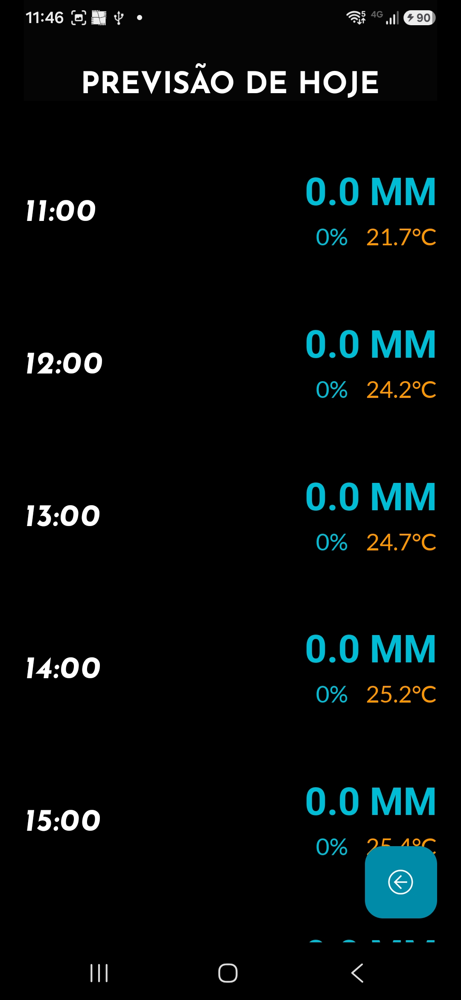

  

# Tempo Limpo

 

## Sobre
**Tempo Limpo** é um aplicativo mobile *open-source* desenhado para entregar uma experiência de previsão do tempo minimalista e de visual objetivo. O foco principal é a clareza das informações climáticas, garantindo que os dados sejam apresentados da maneira mais rápida e agradável possível ao usuário.

### Funcionalidades Principais
O aplicativo obtém todas as suas informações através de APIs especializadas:

*   **OpenMeteo:** Utilizada para o processamento completo e detalhado das previsões meteorológicas.
*   **Nominatim:** Responsável por realizar a geocodificação, permitindo que o usuário defina qualquer localidade mundial (latitude e longitude).

> **Compatibilidade:** Embora este projeto tenha sido inicialmente pensado para Android, por ser desenvolvido em React Native, ele é totalmente compatível com *builds* destinados ao iOS.

---

## Demonstração Visual
Veja como as diferentes telas do aplicativo são apresentadas:

<table>
  <tr>
    <td align="center" width="33%">
      
       
      <b>Busca de Localidades</b>
    </td>
    <td align="center" width="33%">
      
       
      <b>Previsão Geral</b>
    </td>
    <td align="center" width="33%">
      
       
      <b>Detalhes Horários</b>
    </td>
  </tr>
</table>

---

## Instalação e Build
Você pode obter os builds prontos do projeto nas [Releases](https://github.com/TM1744/tempo_limpo-app/releases/tag/v1.0.0). Basta baixar o arquivo `.APK` para instalá-lo diretamente no seu dispositivo Android.

**Build Local:** Para desenvolvedores que desejam rodar localmente, é recomendado utilizar o **EAS-CLI**. Esta ferramenta permite gerar tanto os arquivos `.APK` (Android) quanto o build para iOS. Consulte a [documentação](https://docs.expo.dev/build/introduction/) completa para guias detalhados de geração de *builds*.

## Limitações e Observações Técnicas
Para garantir uma experiência fluida, o aplicativo gerencia ativamente os dados em cache (localidades e previsões). No entanto, é fundamental estar ciente das seguintes limitações impostas pelas APIs externas:

*   **Limite de Taxa Nominatim:** É permitido apenas **1** requisição por segundo para busca de latitude/longitude. O aplicativo já incorpora um *delay* de **2** segundos para cada chamada à Nominatim.
*   **Limite Diário OpenMeteo:** A OpenMeteo estabelece um limite máximo de **10.000** requisições diárias.

> **Observação Importante:** O APP salva e gerencia automaticamente as localidades e previsões de dias em cache para reduzir a quantidade de chamadas às APIs. Entretanto, você ainda pode realizar requisições de novos dados trocando as localidades e atualizando a previsão de dias por conta própria (botão de refresh).

Para mais detalhes sobre o uso dessas APIs, acesse a documentação da [Nominatim](https://nominatim.org/) e da [OpenMeteo](https://open-meteo.com/).

## Próximas Funcionalidades

*   **Configurações de Tema:** Suporte a modos claro e escuro.
*   **Controle de API:** Definição da quantidade de localidades/dias previstos por resposta da API.
*   **Visualização de Estatísticas:** Opções de preferência (ex: Índice de chuva, Temperatura máxima, Chance de chuva).

---

## Créditos e Licenças
Este projeto é construído sobre serviços de terceiros que merecem reconhecimento:

### APIs e Dados
*   **Geocodificação e Busca de Endereços:** [Nominatim](https://nominatim.org/) (dados do [OpenStreetMap](https://www.openstreetmap.org/) - Licença: [ODbL](https://www.openstreetmap.org/copyright)).
*   **Dados Meteorológicos:** [Open-Meteo.com](https://open-meteo.com/) (Licença: [CC BY 4.0](https://creativecommons.org/licenses/by/4.0/)).

### Tipografia
*   **Josefin Sans** (Bold, BoldItalic): Criada por Santiago Orozco (Licença: [SIL Open Font License 1.1](https://scripts.sil.org/OFL)).
*   **Lato** (Light, Regular): Criada por Łukasz Dziedzic (Licença: [SIL Open Font License 1.1](https://scripts.sil.org/OFL)).
